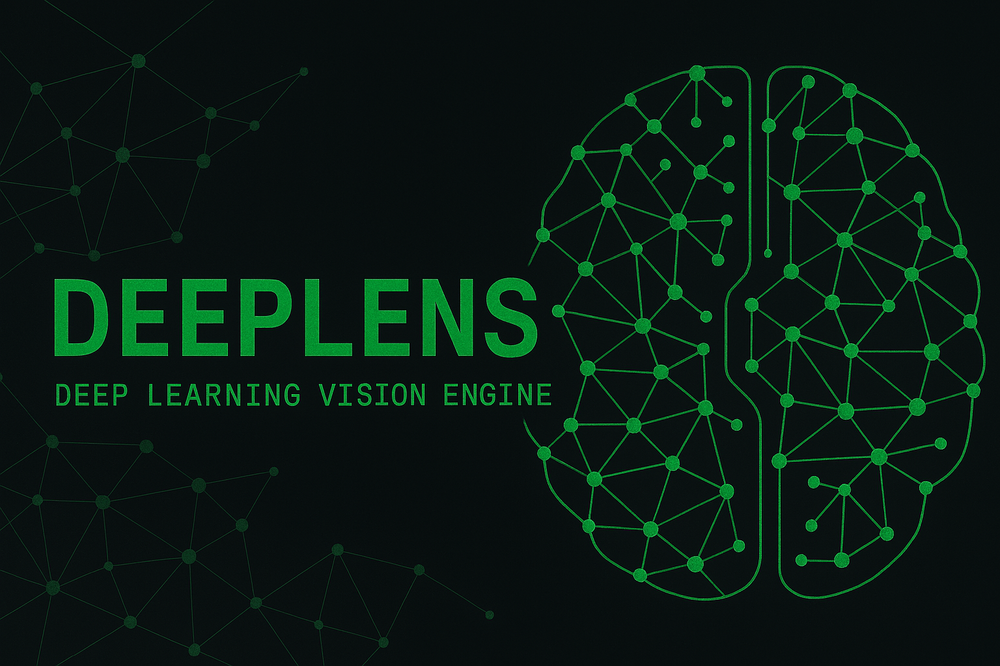
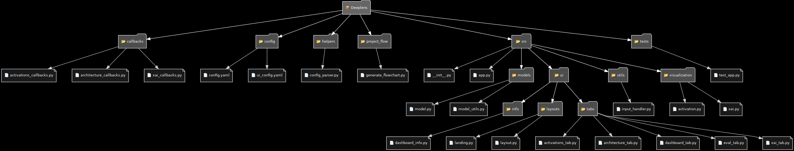

# DeepLens: Interactive Visualization of Neural Network Internals

DeepLens is an interactive dashboard designed to help machine learning engineers and researchers explore the internal activations of deep neural networks.




## Installation

1. **Clone the Repository:**

   ```bash
   git clone https://github.com/zneave/Deeplens
   cd Deeplens
    ```

2. **Install Dependencies:**

   ```bash
    pip install -r requirements.txt
    ```

3. **Run the App:**

   ```bash
    python3 main.py
    ```

## Project Flowchart




## License

This project is licensed under the MIT License – see the LICENSE file for details.

