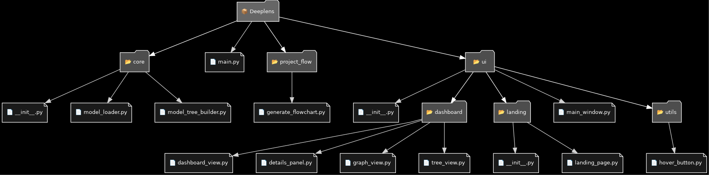

# DeepLens: Interactive Visualization of Neural Network Internals

DeepLens is an interactive dashboard designed to help machine learning engineers and researchers explore the internal activations of deep neural networks. Built with [Dash](https://dash.plotly.com/) and [Dash Bootstrap Components](https://dash-bootstrap-components.opensource.faculty.ai/), DeepLens uses a pretrained ResNet18 model from PyTorch to visualize layer outputs in both single-channel and grid views. The dashboard displays activation maps as heatmaps, and provides statistical summaries for each channel.


## Features

- **Model Activations Visualization:** Explore the internal activations of a pretrained ResNet18 model using PyTorch.
- **Dynamic Controls:**  
  - **Layer Selection:** Choose from multiple layers whose activations are hooked into.
  - **View Mode Toggle:** Switch between a "Single" view (one channel or average) and a "Grid" view (all channels).
  - **Channel Slider:** Select a specific channel (or average) for detailed inspection.
- **Image Upload:** Upload your own image for custom activations.
- **Activation Statistics:** See per-channel statistics such as mean, standard deviation, min, and max.
- **Responsive UI:** Built with Dash and Bootstrap, the layout works across devices.
- **Documentation and Help:** Built-in documentation page and detailed "Learn More" modal for guidance.

## Installation

1. **Clone the Repository:**

   ```bash
   git clone https://github.com/zneave/Deeplens
   cd Deeplens
    ```

2. **Install Dependencies:**

   ```bash
    pip install -r requirements.txt
    ```

3. **Run the App:**

   ```bash
    python3 src/app.py
    ```

Then, open your browser and navigate to http://127.0.0.1:8050 to start exploring.

## Project Flowchart




## Roadmap

- **Enhanced Model Inspection:** More advanced visualization modes such as gradient visualization.
- **User Customization:** Options to save and load custom configurations.
- **Comparison Mode:** Upload multiple images and compare activation maps side by side.

## License

This project is licensed under the MIT License – see the LICENSE file for details.

